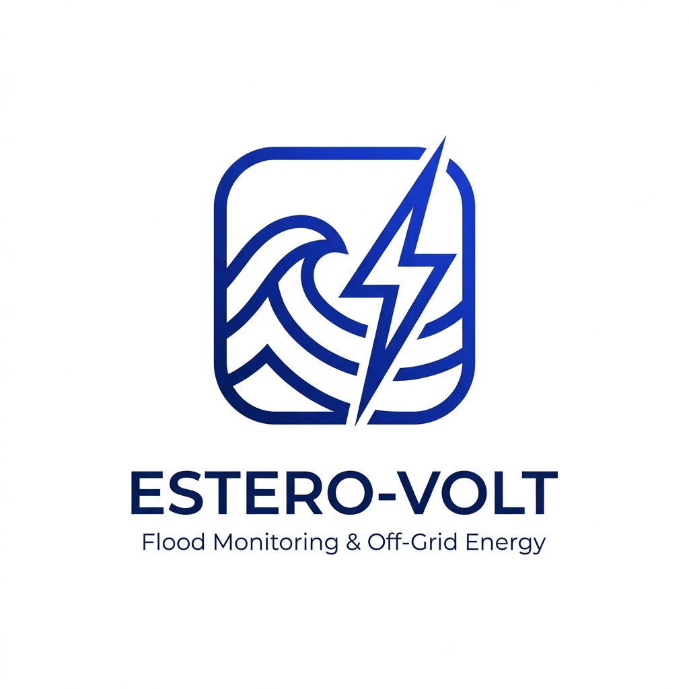

<div align="center">
  
  <h1>WATT-The-WASTE: Estero-Volt</h1>
  <p><b>Autonomous Hydrological Telemetry & Off-Grid Flood Risk Edge-AI</b></p>
  <p><i>Official Mobile Prototype for the JA WE Challenge</i></p>
</div>

---

## 🌊 Overview

**Estero-Volt** is a next-generation urban flood telemetry network designed for the Naga City Disaster Risk Reduction & Management Office (CDRRMO). It leverages **Sediment Benthic Microbial Fuel Cells (BMFCs)** to harvest clean energy directly from river muck, powering autonomous LoRaWAN IoT sensors and on-device Edge-AI neural networks.

## ✨ Key Features

- **🔋 Zero-Waste Off-Grid Power**: Fully powered by BMFCs and 100F EDLC supercapacitors, eliminating toxic lithium battery waste in waterways.
- **🧠 On-Device Edge-AI**: Local Multilayer Perceptron (MLP) neural net predicts flood risks and lead times without relying on cloud computation during storms.
- **🗺️ Interactive GIS Radar**: High-performance OpenStreetMap vector visualization of the Naga River basin and estero tributaries.
- **📡 Live Mesh Telemetry**: Real-time integration of water depth, supercapacitor state of charge (SOC), and bacterial bio-voltage (mW).
- **🚨 Automated Emergency Dispatch**: Instant SMS alert simulation and priority ranking for high-risk zones.

## 🛠️ Technology Stack

- **Framework**: React Native (Expo SDK 57)
- **UI Architecture**: Senior-grade Glassmorphism, Dynamic Floating Navigation, SVG Radial Gauges
- **Platform**: Cross-platform Mobile (iOS/Android) & Responsive Web App (Vercel)
- **AI/ML Integration**: Python-trained Edge-AI Hydrology Models

## 🚀 Live Demo

Experience the responsive web prototype live on Vercel:
👉 **[https://estero-volt.vercel.app](https://estero-volt.vercel.app)**

## 💻 Development Setup

```bash
# Install dependencies
npm install

# Start the Expo development server (Web, iOS, Android)
npx expo start

# Export static web bundle for production
npx expo export --platform web
```

---
<div align="center">
  <p><i>Developed for the JA WE Challenge • Innovating for a Resilient Future</i></p>
</div>
